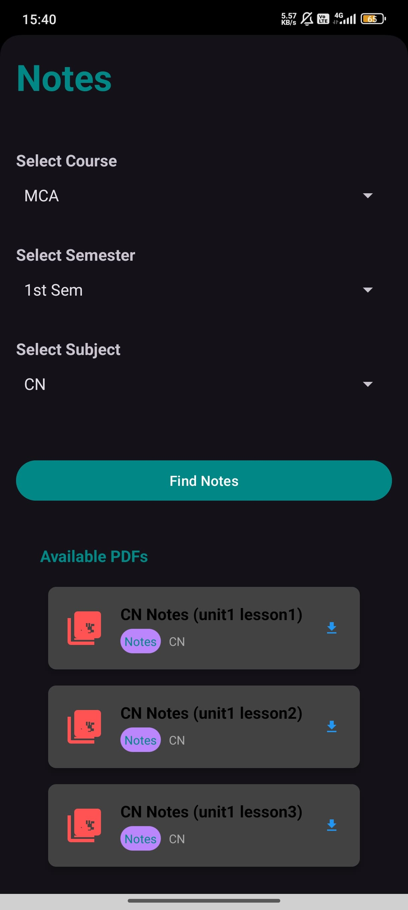
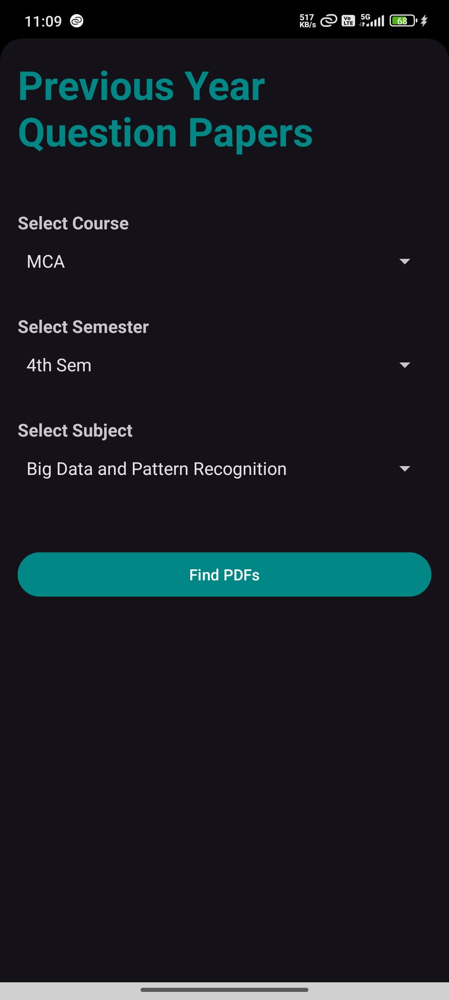

# 📚 KUK Exam Prep – Android App

**KUK Exam Prep** is an Android application designed for Kurukshetra University students. It provides semester-wise study material, previous year papers, and notes to help with academic preparation.

---

## 🛠️ Built With
- Java
- XML (Android UI)
- Android Studio

---

## 📲 Features
- 📘 Semester-wise subject selection
- 📄 Access notes & question banks
- 🎯 Simple and responsive UI
- 💡 Lightweight and user-friendly

---

## 📷 Screenshots
<p align="center">
### Splash Screen


### 🧭 Dashboard Screen


### 🔐 Sign-in Screen


### Sign-Up Screen


### Notes Screen



### Previous Year Question Papers Screen


### Datesheets Screen

</p>
---

## 🚀 Getting Started

To run the app locally:

```bash
1. Clone the repo
2. Open with Android Studio
3. Build and run on emulator or device
